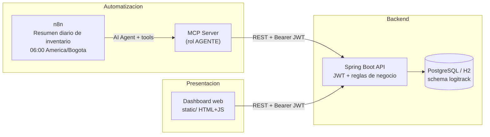

# Diagrama de arquitectura — LogiTrack IQ

Flujo de datos exigido por el reto integrador IA2.

## Responsabilidades

| Componente | Rol |
| --- | --- |
| **n8n** | Orquesta el agente diario: consulta KPIs/riesgo, crea máx. 1 orden BORRADOR, publica resumen. |
| **MCP** | Pasarela HTTP autenticada; 6 tools; sin reglas de negocio ni acceso directo a MySQL. |
| **API Spring Boot** | Fuente de verdad: stock, riesgo, órdenes, PDF, panel, auditoría. |
| **Dashboard** | Consume la API; ADMIN aprueba/recibe; visualiza PDF BORRADOR con watermark. |

## Tools MCP → API

| Tool | Endpoint |
| --- | --- |
| `consultar_stock_producto` | `GET /api/productos/{id}/stock` |
| `consultar_bodegas_criticas` | `GET /api/bodegas/criticas` |
| `consultar_productos_en_riesgo` | `GET /api/productos/riesgo` |
| `consultar_kpis` | `GET /api/kpis` |
| `crear_orden_borrador` | `POST /api/ordenes` |
| `publicar_resumen` | `POST /api/panel/resumen` |

No existe tool para aprobar, cancelar ni recibir órdenes.
