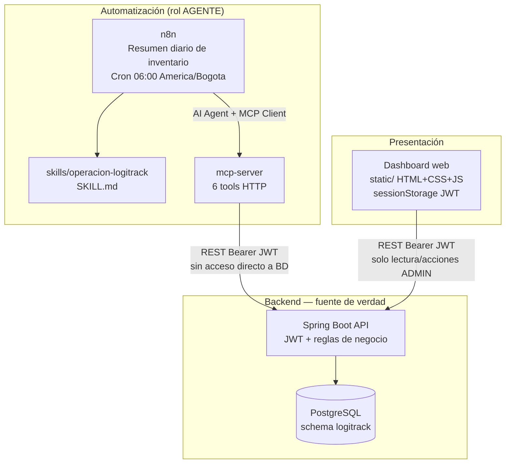
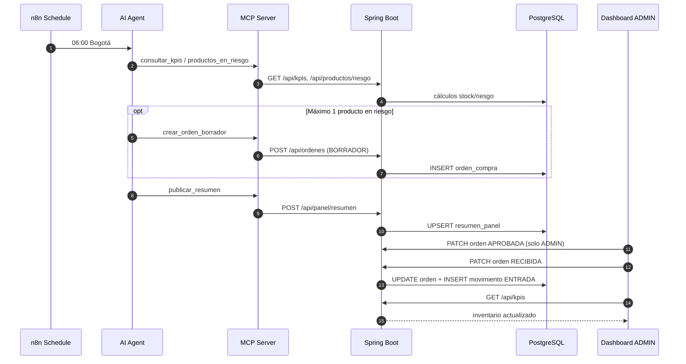

# Diagrama de arquitectura — LogiTrack IQ

Flujo de datos exigido por el reto integrador IA2. La base de datos implementada es **PostgreSQL** (esquema `logitrack`); el PDF usa “MySQL” como metáfora de “no acceder a la BD desde MCP/n8n/dashboard”.

## Vista general

## Flujo de negocio de punta a punta

## Responsabilidades por componente

| Componente | Rol | Qué **no** hace |
| --- | --- | --- |
| **n8n** | Orquesta el agente diario: KPIs, riesgo, ≤1 BORRADOR, resumen | No aprueba órdenes; no escribe en BD |
| **MCP** | Pasarela HTTP con JWT `AGENTE`; 6 tools fijas | Sin reglas de negocio; sin SQL |
| **API Spring Boot** | Stock, riesgo, KPIs, órdenes, PDF, panel, auditoría | Única fuente de verdad |
| **PostgreSQL** | Persistencia | Solo vía JPA desde API |
| **Dashboard** | Visualiza datos; ADMIN cambia estados | No calcula inventario |

## Tools MCP → API

| Tool | Endpoint |
| --- | --- |
| `consultar_stock_producto` | `GET /api/productos/{id}/stock` |
| `consultar_bodegas_criticas` | `GET /api/bodegas/criticas` |
| `consultar_productos_en_riesgo` | `GET /api/productos/riesgo` |
| `consultar_kpis` | `GET /api/kpis` |
| `crear_orden_borrador` | `POST /api/ordenes` |
| `publicar_resumen` | `POST /api/panel/resumen` |

**No existe** tool para aprobar, cancelar ni recibir órdenes (restricción obligatoria del PDF).

## Ubicación en el repositorio

| Pieza | Ruta |
| --- | --- |
| API + servicios IQ | `logitrack/src/main/java/com/example/logitrack/` |
| Dashboard | `logitrack/src/main/resources/static/` |
| MCP | `mcp-server/main.py` |
| Flujo n8n | `n8n/resumen-diario-inventario.json` |
| Skill | `skills/operacion-logitrack/SKILL.md` |
| Esquema BD | `logitrack/database/schema.sql` |

## Documentación relacionada

- [Arquitectura en código](arquitectura-codigo.md)
- [Alineación con el PDF](alineacion-requisitos-pdf.md)
- [Wireframes](wireframes.md)
