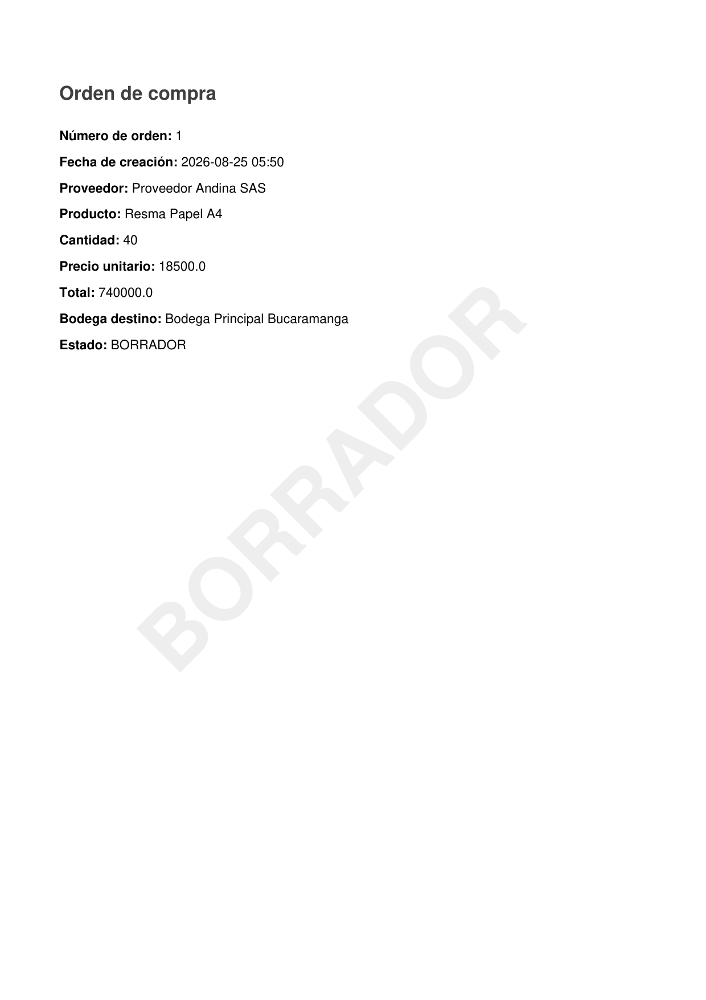

# Evidencia — PDF orden en BORRADOR

Requisito: PDF guardado en la orden con **marca de agua diagonal** legible `BORRADOR`.

## Evidencia generada

| Campo | Valor |
| --- | --- |
| Fecha | 2026-08-25 |
| ID orden | 1 (Resma Papel A4, estado BORRADOR) |
| Captura UI / API | [capturas/pdf-generar-desde-dashboard.png](capturas/pdf-generar-desde-dashboard.png) |
| Captura watermark | [capturas/pdf-borrador-watermark.png](capturas/pdf-borrador-watermark.png) |
| PDF guardado | [capturas/orden-borrador-1.pdf](capturas/orden-borrador-1.pdf) |



## Pasos ejecutados

1. `POST /api/ordenes/1/pdf` como **ADMIN** (`admin_logitrack` / `123456`).
2. PDF guardado en BD (`fechaGeneracionPdf` actualizada).
3. Rasterizado página 1 → `pdf-borrador-watermark.png` (marca diagonal visible).

## Verificación tras cambio de estado

1. `PATCH /api/ordenes/1/estado` → `APROBADA`.
2. `GET /api/ordenes/1/pdf` → **HTTP 404** (PDF invalidado).
3. Captura: [capturas/pdf-404-tras-aprobar.png](capturas/pdf-404-tras-aprobar.png)

## Comandos de reproducción

```bash
TOKEN=$(curl -s -X POST http://localhost:8080/auth/login \
  -H "Content-Type: application/json" \
  -d '{"username":"admin_logitrack","password":"123456"}' | jq -r .accessToken)

curl -s -X POST "http://localhost:8080/api/ordenes/1/pdf" \
  -H "Authorization: Bearer $TOKEN" \
  -o docs/evidencia/capturas/orden-borrador-1.pdf

curl -s -o /dev/null -w "%{http_code}" \
  "http://localhost:8080/api/ordenes/1/pdf" \
  -H "Authorization: Bearer $TOKEN"
# Tras aprobar: 404
```

## Checklist

- [x] PDF generado y guardado
- [x] Watermark diagonal `BORRADOR` visible en captura
- [x] Tras aprobar: PDF anterior no disponible (404)
- [ ] Regenerar PDF en estado APROBADA (sin watermark) — opcional para demo
