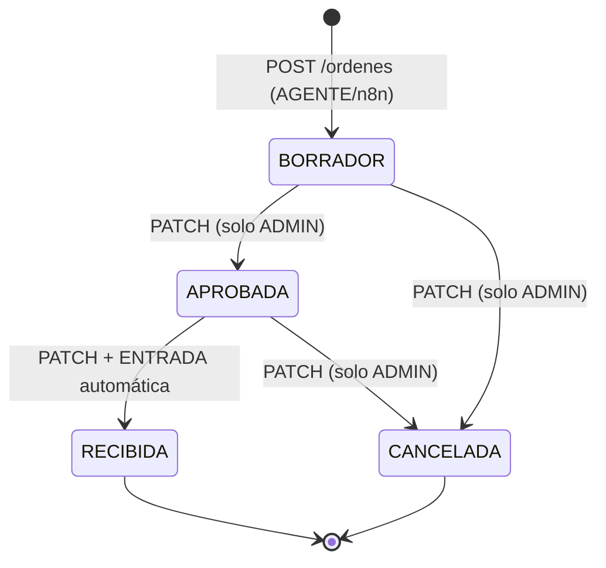
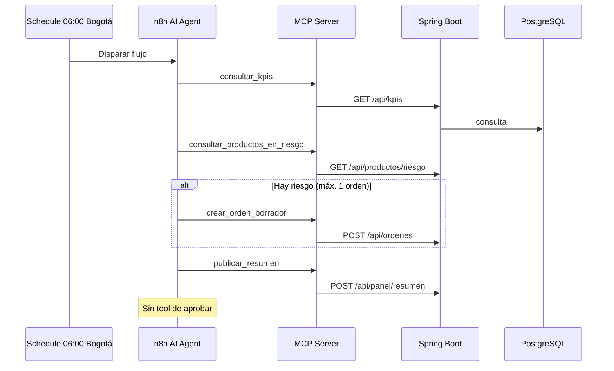

# Wireframes — LogiTrack IQ

Bocetos de las pantallas exigidas por el reto. El diseño real está en `logitrack/src/main/resources/static/`; estos wireframes explican **qué** se muestra y **por qué**, alineados con el PDF.

---

## 1. Login (reutilizado del reto anterior)

**Motivo:** El dashboard IQ consume la misma sesión JWT que el resto del sistema. El reto exige reutilizar login y guardar el token solo en `sessionStorage`.

```
┌─────────────────────────────────────────────────────────────┐
│                                                             │
│                    ┌─────────────────────┐                  │
│                    │  [Logo] LogiTrack   │                  │
│                    │  Bienvenido de vuelta│                  │
│                    ├─────────────────────┤                  │
│                    │ Usuario: [________] │                  │
│                    │ Contraseña: [____]  │                  │
│                    │ [ Iniciar Sesión ]  │                  │
│                    └─────────────────────┘                  │
│                                                             │
└─────────────────────────────────────────────────────────────┘
```

| Elemento | Comportamiento | Código |
| --- | --- | --- |
| Formulario login | `POST /auth/login` | `app.js` — handler `#login-form` |
| Token | Solo `sessionStorage` (`logitrack_token`, `logitrack_rol`) | `saveSession()` / `clearSession()` |
| Roles | ADMIN ve botones Aprobar/Recibir; AGENTE solo consulta IQ | `isAdmin()` |

---

## 2. Dashboard IQ — vista principal (torre de control)

**Motivo:** Concentrar en una sola pantalla los cuatro indicadores, el resumen publicado por n8n, el riesgo operativo y las órdenes pendientes de decisión humana.

```
┌──────────┬──────────────────────────────────────────────────────────────────┐
│ Sidebar  │  Dashboard                                    [● Conectado]      │
│          │  Calculado en … · America/Bogota                               │
│ Dashboard│  ┌─────────┐ ┌─────────┐ ┌─────────┐ ┌─────────┐               │
│ Órdenes  │  │ Ocup.   │ │ Quiebre │ │ Riesgo  │ │ Órdenes │               │
│ Bodegas  │  │ máx %   │ │   N     │ │   N     │ │ BORR.   │               │
│ …        │  └─────────┘ └─────────┘ └─────────┘ └─────────┘               │
│          │  ┌──────────────────────┐ ┌──────────────────────┐             │
│          │  │ Ocupación por bodega │ │ Movimientos de ayer  │             │
│          │  │ [====92%====] Bogotá │ │ E:2  S:3  T:1        │             │
│          │  └──────────────────────┘ └──────────────────────┘             │
│          │  ┌────────────────────────────────────────────────────────────┐ │
│          │  │ Resumen del panel (n8n)              fecha: 2026-08-24    │ │
│          │  │ Narrativa: "Hay productos en riesgo…"                     │ │
│          │  │ [ALTA] Alerta producto X…                                 │ │
│          │  │ • REVISAR_ORDEN — Revisar orden 14…                       │ │
│          │  └────────────────────────────────────────────────────────────┘ │
│          │  ┌────────────────────────────────────────────────────────────┐ │
│          │  │ Productos en riesgo (tabla)                               │ │
│          │  │ Producto | Stock | Consumo | P.Reorden | Cobertura | …    │ │
│          │  └────────────────────────────────────────────────────────────┘ │
│          │  ┌────────────────────────────────────────────────────────────┐ │
│          │  │ Órdenes BORRADOR                                          │ │
│          │  │ # | Producto | … | [Generar PDF][Ver] | [Aprobar]*        │ │
│          │  └────────────────────────────────────────────────────────────┘ │
│          │  * Aprobar solo visible si rol = ADMIN                        │
└──────────┴──────────────────────────────────────────────────────────────────┘
```

### Mapeo requisito PDF → sección HTML

| Bloque wireframe | Requisito PDF | ID / función JS |
| --- | --- | --- |
| 4 tarjetas superiores | Indicadores fijos | `renderKpis()` → `#kpi-*` |
| Ocupación por bodega | Lista por bodega, no solo tarjeta | `#kpi-ocupacion-list` |
| Movimientos ayer | Bloque informativo | `#kpi-movimientos-ayer` |
| Resumen del panel | POST n8n → GET panel | `renderPanelResumen()` |
| Tabla riesgo | GET `/productos/riesgo` | `renderRiesgo()` |
| Tabla BORRADOR | GET `/ordenes?estado=BORRADOR` | `renderOrdenesTabla(..., true)` |
| PDF | POST/GET `/ordenes/{id}/pdf` | `generarPdfOrden`, `verPdfOrden` |
| Aprobar | Solo ADMIN | `botonesEstado()` |

HTML: `index.html` sección `#page-dashboard` (aprox. líneas 201–361).

---

## 3. Página Órdenes (detalle y filtros)

**Motivo:** El ADMIN necesita ver historial completo, filtrar por estado y recibir órdenes `APROBADA`.

```
┌──────────┬──────────────────────────────────────────────────────────────────┐
│ Sidebar  │  Órdenes                                                         │
│          │  [ Filtro: BORRADOR ▼ ] [ Actualizar ]                           │
│          │  ┌────────────────────────────────────────────────────────────┐ │
│          │  │ ID | Estado | Producto | Proveedor | … | PDF | Acciones    │ │
│          │  │ 14 | BORRADOR | … | [Gen PDF][Ver] | [Aprobar][Cancelar]   │ │
│          │  │ 12 | APROBADA | … | …          | [Recibir][Cancelar]       │ │
│          │  └────────────────────────────────────────────────────────────┘ │
└──────────┴──────────────────────────────────────────────────────────────────┘
```

Código: `#page-ordenes`, `loadOrdenes()`, `cambiarEstadoOrden()`.

---

## 4. Flujo de estados (diagrama)



Al cualquier transición: **PDF guardado se elimina** (debe regenerarse).

---

## 5. Flujo de automatización (n8n)



---

## 6. Wireframes responsive

### Desktop (> 1024 px)

- Sidebar fija a la izquierda.
- Cuatro tarjetas KPI en fila (`grid` 4 columnas).
- Dos columnas: ocupación + movimientos ayer.

### Tablet (768–1024 px)

- KPI en **2×2** (`@media max-width: 1024px`).
- Sidebar sigue visible en desktop ancho; en ≤768 pasa a drawer.

### Móvil (≤ 768 px)

```
┌─────────────────────────┐
│ [≡] Dashboard    [●]    │
├─────────────────────────┤
│ [ KPI 1 ] [ KPI 2 ]     │
│ [ KPI 3 ] [ KPI 4 ]     │
│ (≤480px: 1 columna)     │
├─────────────────────────┤
│ Ocupación (lista)       │
├─────────────────────────┤
│ Ayer E/S/T              │
├─────────────────────────┤
│ Resumen panel           │
├─────────────────────────┤
│ Tabla riesgo → scroll → │
├─────────────────────────┤
│ Tablas órdenes → scroll │
└─────────────────────────┘
```

**Motivo del scroll horizontal:** Las tablas IQ tienen muchas columnas; `.table-wrapper { overflow-x: auto }` evita romper el layout en pantallas estrechas (requisito PDF: legibilidad, no diseño móvil avanzado).

Breakpoints en `style.css` líneas 1314–1345.

---

## 7. Modal PDF (visualización)

**Motivo:** El reto pide visualizar el PDF en navegador (`application/pdf`). La implementación abre una nueva pestaña con blob URL tras `POST` (generar) o `GET` (ver).

```
Usuario → [Generar PDF] → POST /ordenes/{id}/pdf → blob → window.open
Usuario → [Ver]         → GET  /ordenes/{id}/pdf → blob → window.open
```

Si orden en `BORRADOR`, el PDF muestra marca de agua diagonal **BORRADOR** (`OrdenPdfService.dibujarMarcaAguaDiagonal`).

---

## Referencias

- Implementación visual: [`frontend-dashboard.md`](frontend-dashboard.md)
- Alineación PDF: [`alineacion-requisitos-pdf.md`](alineacion-requisitos-pdf.md)
- Archivos: `logitrack/src/main/resources/static/index.html`, `style.css`, `app.js`
